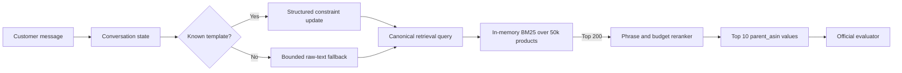

# Shopping Copilot

A constraint-aware conversational search agent for TechJam 2026 Problem Statement 4. The agent turns vague or changing shopping requests into ranked products from a frozen 50,000-item Amazon catalog.

The selected submission is fully local and deterministic. It keeps conversation state, asks an open clarification question, handles intent overrides, retrieves 200 lexical candidates with in-memory BM25, and reranks them by disclosed phrase and budget fidelity.

## Verified result

The final policy was evaluated on the unchanged official 200-session public set.

| Metric | Result |
|---|---:|
| HitRate@10 | **0.925** |
| MRR | **0.656911** |
| MTTC | **2.98 turns** |
| Efficiency | **0.802** |
| Technical Score | **0.819973** |
| API tokens and model cost | **0 / $0** |

Every scenario reached at least 0.90 HitRate@10: Boundary 1.00, Browsing 0.9375, Buying 0.9125, and Intent Override 0.90. The complete result is in [`results_phaseF.json`](results_phaseF.json), and the controlled experiments are documented in [`docs/ablation_study.md`](docs/ablation_study.md).

## How it addresses the problem

Traditional keyword search treats each message as an isolated query. Shopping Copilot keeps an explicit session state instead:

- It accumulates disclosed requirements across turns.
- It removes the stale turn-one preference when the customer changes direction.
- It retains untemplated or paraphrased user text as bounded fallback context.
- It asks for `other`, allowing the simulator to reveal up to two useful constraints without guessing an overly narrow attribute.
- It ranks products by exact constraint coverage and budget fit after retrieval.

The team built keyword, category, vector, hybrid, and neural reranking components. We did not force every component into the final scorer. Controlled ablations showed that BM25 at depth 200 plus deterministic reranking produced the best weighted result while avoiding model startup, network access, credentials, and API cost.

## Selected architecture



The organizer imports [`starter.agent.Agent`](starter/agent.py), which re-exports the team implementation in [`shopping_copilot/agent.py`](shopping_copilot/agent.py). The evaluator-facing path does not call an LLM, vector index, Supabase, or any external service.

The repository also contains the broader prototype stack under `shopping_copilot/app/`: FastAPI orchestration, buying and browsing pipelines, local embedding and reranking experiments, Supabase adapters, and a React prototype. Those components record the team's exploration but are not required for official Phase F scoring.

## Repository structure

```text
starter/agent.py                 Official import entry point
shopping_copilot/agent.py       Selected evaluator-facing Agent
shopping_copilot/app/           Broader API and experimental agent stack
shopping_copilot/scripts/       Demo, index, smoke-test, and report utilities
evaluator/local_evaluator.py    Unmodified local scoring harness
data/public_set.jsonl           200 public development sessions
starter/catalog.jsonl           Frozen 50,000-product catalog
tests/                          Contract and retrieval-policy tests
docs/ablation_study.md          Controlled architecture experiments
results_phaseF.json             Selected run and per-session evidence
```

## Setup

### Requirements

- Python 3.11 is the tested version.
- The frozen catalog and BM25 index are loaded into memory at runtime.
- No credentials or network access are needed at runtime for the official Agent.

From the repository root:

```bash
python -m venv .venv
```

Activate it on Windows:

```bash
.venv\Scripts\activate
```

Or on macOS/Linux:

```bash
source .venv/bin/activate
```

Install the declared dependencies:

```bash
python -m pip install --upgrade pip
python -m pip install -r requirements.txt
```

The dependency list covers both the selected scorer and the experimental API/model stack. Phase F itself performs no model inference and makes no external calls.

## Reproduce the result

Run the tests:

```bash
python -m unittest discover -s tests -p "test_*.py" -v
```

Run the official 200-session evaluator:

```bash
python -m evaluator.local_evaluator \
  --catalog starter/catalog.jsonl \
  --dataset data/public_set.jsonl \
  --output results.json
```

On Windows Command Prompt, enter the same command on one line. The expected aggregate values are:

```text
HitRate@10      0.925
MRR             0.656911
MTTC            2.98
Efficiency      0.802
Technical Score 0.819973
```

Print a compact report from the preserved selected run:

```bash
python shopping_copilot/scripts/eval_report.py results_phaseF.json
```

Run one narrated, multi-turn Intent Override example:

```bash
python shopping_copilot/scripts/demo_session.py --sample-id public_0003
```

Expect a short cold-start pause while the in-memory index is built. Retrieval after startup is local and does not download models.

## Optional prototype API

The FastAPI and React prototype is not required for judging or reproduction of the selected Agent. If you want to inspect it, copy `shopping_copilot/.env.example` to an ignored `.env`, fill only the optional services you intend to use, and start the API from `shopping_copilot`:

```bash
uvicorn app.main:app --reload
```

Do not add credentials to the repository. The official scorer ignores these optional settings.

## Development tools, APIs, and libraries

- Development and evaluation: Python 3.11, Git/GitHub, the official TechJam evaluator, JSONL, and unittest.
- Selected scoring path: Python standard library plus the team's in-memory Okapi BM25 and deterministic reranker.
- Prototype frameworks: FastAPI, Pydantic, React, Vite, and Lucide React.
- Experiments: NumPy, PyTorch, Hugging Face Transformers, Sentence Transformers, Qwen3-Embedding-0.6B, and Qwen3-Reranker-0.6B.
- Optional integrations: an OpenAI-compatible chat API and Supabase/pgvector. Neither is used by the selected evaluator path.

## Dataset and assets

The frozen competition package is derived from [Amazon Reviews 2023](https://amazon-reviews-2023.github.io/) by McAuley Lab at UCSD, using the `Clothing_Shoes_and_Jewelry` category. The catalog contains 50,000 products, and the public development set contains 200 simulated sessions. See [`DATA_ATTRIBUTION.md`](DATA_ATTRIBUTION.md) for field and usage details.

No product images, copyrighted music, private holdout labels, personal identifiers, or third-party credentials are included.

## Limitations and what we would improve

- The raw-text fallback protects against unrecognized phrasing, but the final reranker still rewards literal phrase overlap. A lightweight structured paraphrase extractor would improve synonym handling without adding an LLM dependency.
- The public set has 200 sessions. The preserved ablations reduce overfitting risk, but private-set performance can still differ.
- The in-memory BM25 build favors reproducibility over instant cold starts. A serialized local index would reduce startup time.
- Vector and neural reranking remain experimental because they did not beat the selected weighted score within the CPU latency budget.
- The prototype API and UI are not production systems. Authentication, rate limits, durable session storage, monitoring, and accessibility work would be needed before deployment.

## Team contributions

Contributions below are based on the repository history.

- **muu77muu**: backend services, orchestration, context and session state, buying/browsing pipelines, retrieval and ranking integration, and chat API work.
- **ZionTan944**: catalog, filtering, product comparison, wishlist experience, frontend pages, and early Supabase product integration.
- **KevanSoon**: local and hybrid retrieval, embedding and reranking experiments, phrase/price reranking, retrieval ablations, and technical reporting.
- **Ong Jiong Hui**: official evaluator bridge, final offline retrieval policy, depth selection, verification, paraphrase hardening, and submission preparation.

## Supporting evidence

- [Ablation study](docs/ablation_study.md)
- [Submission rules](docs/submission_rules.md)

Public repository: https://github.com/muu77muu/tiktok-hackathon-2026
